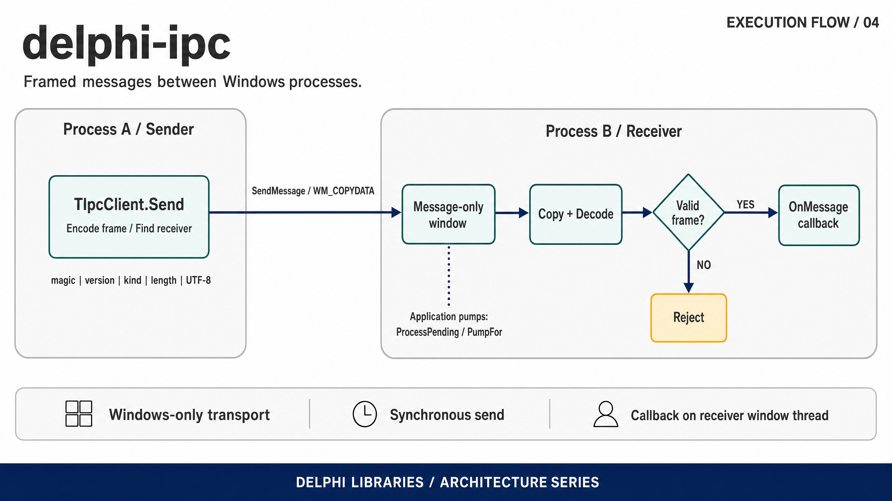

# WinIPC

[](https://github.com/ramonruanxc/delphi-ipc/actions/workflows/ci.yml)
[](LICENSE)

Send structured messages between Windows processes over `WM_COPYDATA`.

`WM_COPYDATA` is the Win32 mechanism built for exactly this: handing a block of
bytes to another process's window, with the kernel marshalling it across the
boundary. No sockets, no named pipes, no shared files — just two processes and
a window. WinIPC wraps it in a small typed API and a self-describing frame.

```pascal
// receiver
Server := TIpcServer.Create('my-channel', OnMessageHandler);
// ... in your idle loop:
Server.ProcessPending;

// sender, in another process
Msg.Kind := 1;
Msg.Payload := 'hello, other process';
TIpcClient.Send('my-channel', Msg);
```

## Quick start

```
git clone https://github.com/ramonruanxc/delphi-ipc.git
cd delphi-ipc
```

**Delphi XE7 or later** — open `demo/Demo.dpr` and press F9. There is nothing
to configure: every unit is referenced from the `.dpr` with its path, and the
IDE creates its own project file for your Delphi version. Win32 is the default
target; for Win64, add the *Windows 64-bit* platform under *Target Platforms*
in the Project Manager and press F9 again. Under the debugger the console waits
for Enter so the result stays readable.

**Free Pascal 3.2.2** — from the repository root, one command builds and runs
it (cmd.exe or PowerShell 7+; in Git Bash write `demo/Demo.exe`):

```
fpc demo/Demo.dpr && demo\Demo.exe
```

Expected output (process ids vary):

```
WinIPC demo: one message between two processes over WM_COPYDATA
  receiver  pid 60736  listening on "winipc-demo-60736"
  sender    pid 29504  started as a separate process
  received  kind=1  "hello from another process"
  sender    delivered.
OK: process 29504 sent "hello from another process" to process 60736 over WM_COPYDATA.
```

The demo starts a second copy of itself as the sender, so the message really
crosses a process boundary. It exits with code 0 after the `OK:` line, or
prints `FAILED:` and exits with 1.

**Compiler status.** Free Pascal 3.2.2 is verified in CI: framing tests on
Linux; transport tests, demo build and demo run on Windows. Delphi XE7 and
later is the intended target, but no Delphi compiler has built or run this
code yet (Community Edition refuses command-line builds), so treat Delphi
support as untested and please report anything F9 turns up.

---

## Execution flow



The client encodes a message and sends it synchronously through Windows
WM_COPYDATA. The receiving application pumps its message-only window, validates
the frame and invokes its callback on that window's owning thread.

## Install

With [Boss](https://github.com/HashLoad/boss):

```
boss install github.com/ramonruanxc/delphi-ipc
```

Or add `src` to your search path. Targets Delphi XE7 or later (not yet
compiled with Delphi, see *Compiler status* above) and Free Pascal 3.2 in
Delphi mode. The transport is Windows-only; the framing builds anywhere.

## How it works

**The receiver is a message-only window.** `TIpcServer` creates a window
parented to `HWND_MESSAGE`: it never shows, is not enumerated as a top-level
window, and exists only to receive messages — exactly what a background IPC
endpoint wants. The channel name becomes the window class, so a sender finds it
with `FindWindowEx` under `HWND_MESSAGE`.

**The sender uses `SendMessage`, never `PostMessage`.** The kernel only marshals
the buffer across the process boundary for the duration of a synchronous
`SendMessage`. A posted message would hand the receiver a pointer into the
sender's address space — a bug that looks like it works until the sender frees
the buffer.

**Cross-integrity delivery is allowed explicitly.** When one process runs
elevated and the other does not, User Interface Privilege Isolation silently
drops the message. `TIpcServer` calls `ChangeWindowMessageFilterEx` to allow
`WM_COPYDATA` through, so an elevated app can receive from a normal one.

**The payload is a self-describing frame.** `WinIPC.Message` encodes a
`(kind, payload)` pair as `magic | version | kind | length | bytes`, and
decoding validates every field. A frame that claims more payload than it
carries — the classic buffer-overrun trap — is rejected, not trusted. This part
has no Windows dependency and is where most of the tests live.

## API

```pascal
TIpcMessage = record
  Kind: UInt32;      // caller-defined message kind
  Payload: string;   // carried as UTF-8 on the wire
end;

TIpcServer = class
  constructor Create(const AChannel: string; AOnMessage: TIpcMessageEvent);
  function ProcessPending: Integer;        // dispatch queued messages, no block
  function PumpFor(ATimeoutMs: Cardinal): Boolean;  // block until one arrives
  property Handled: Int64;                 // count of valid messages received
end;

TIpcClient = class
  class function Send(const AChannel: string;
    const AMessage: TIpcMessage): TIpcSendResult;   // srDelivered / srNoServer / ...
end;
```

`ProcessPending` is for an app with its own message loop — call it when idle.
`PumpFor` is for a program whose only job is to wait for IPC.

Note on `PumpFor`: a `WM_COPYDATA` sent from another thread or process is
dispatched as a *side effect* of `PeekMessage`, which still returns `False`.
Delivery is therefore judged by the `Handled` counter, not by whether the pump
loop saw a queued message — a distinction that is easy to get wrong and is
pinned by a test.

## Building from a clone

Every `.dpr` lists its units with explicit `in '...'` paths, so **opening one in
the Delphi IDE and pressing build works with nothing to configure** — no search
path, no library path.

Free Pascal honours the `in` clause too, but resolves it against the current
directory rather than the `.dpr`'s, so a build from the repository root adds
`-Fusrc` (and `-Futests` for the test suites). Every example below includes
them.

Sources are UTF-8. The files whose string literals contain non-ASCII text
start with a UTF-8 BOM, so that Delphi reads them as UTF-8 instead of the
system ANSI code page; Free Pascal honours the same BOM.

## Demo

`demo/Demo.dpr` is two real processes. Run with no arguments (see *Quick
start*), it receives in its own process and starts a second copy of itself to
send. To drive the two sides by hand instead, open two consoles:

```
Demo.exe server
Demo.exe client "hello from the other process"
```

The server prints each message it receives; every client run is a separate
process crossing the boundary.

---

## Running the tests

The framing suite is portable and is the Linux CI coverage:

```
fpc -Mdelphi -Fusrc -Futests -FUbuild -obuild/CoreTests tests/CoreTests.dpr
./build/CoreTests
```

The full suite adds the WM_COPYDATA transport and runs on Windows. It performs a
real cross-thread round trip in one process — a server window on the main
thread, a worker thread sending to it — which exercises the same kernel
marshalling path as a true cross-process send, without a second executable:

```
fpc -Mdelphi -Fusrc -Futests -FUbuild -obuild/WinTests.exe tests/WinTests.dpr
./build/WinTests.exe
```

CI runs both: the framing job on Linux, the transport job on Windows.

---

## Licence

MIT. See [LICENSE](LICENSE).
